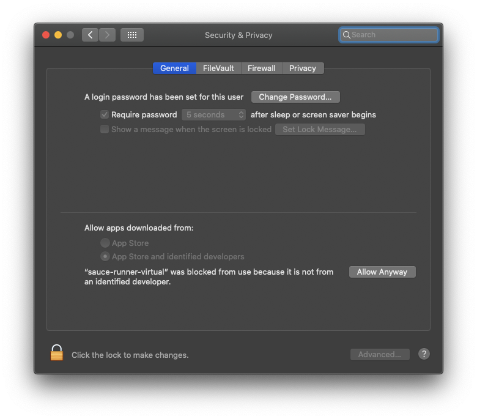

# Espresso with Android emulators
This repo presents an example of executing Espresso test cases on Sauce Labs Emulators as part
of the native framework capability.

## Table of Contents
1. [Prerequisites](#prerequisites)
1. [Setup](#setup)
1. [Execution](#execution)
1. [Examples](#examples)
    1. [Example 1 - Configuration for all tests](#example-1---configuration-for-all-tests)
    1. [Example 2 - Configuration for 2 tests](#example-2---configuration-for-2-tests)
    1. [Example 3 - Run one test on 2 devices](#example-3---run-one-test-on-2-devices)
    1. [Example 4 - Exclude 1 test](#example-4---exclude-1-test)

## Prerequisites
The test runner used by Sauce Labs to execute the Espresso tests is a downloadable file.
The current release is provided in this release but can also be downloaded from the [Sauce Labs Wiki](https://wiki.saucelabs.com/display/DOCS/Sauce+Runner+for+Virtual+Devices+Change+Logs).

The scripts in this repo were developed on macOS and expect JDK 8 or higher to be installed and available.

## Setup
A prebuilt native Android application and it's Espresso test cases are included in this repo. Source to this application can be found on [GitHub](https://github.com/saucelabs/sample-app-mobile).

The application is bundled in [`SauceLabs.Mobile.Sample.Espresso.App.apk`](./SauceLabs.Mobile.Sample.Espresso.App.apk) and the tests cases are bundled in [`SauceLabs.Mobile.Sample.Espresso.Tests.apk`](./SauceLabs.Mobile.Sample.Espresso.Tests.apk).

Make sure that you've added the following to your environment variables

```bash
# For OSX/Linux
export SAUCE_USERNAME=********
export SAUCE_ACCESS_KEY=*******
```

## Execution
Executing a test from this repository is a matter of running `runner-ex{number}.sh` where `{number}` is the number of the example (1 ... 4).

If you run this for the first time on your Mac you might get a warning that the `sauce-runner-virtual` is not safe,
then go to

System Preferrences &rarr; Security and Privacy &rarr; Allow Anyway 
 
see the image below.



## Examples
There are 6 examples provided starting from the most basic and moving up to more advanced approaches. 
More options can be found on the [Sauce Labs Wiki](https://wiki.saucelabs.com/display/DOCS/Command+Reference+for+Sauce+Runner+for+Virtual+Devices).

> **Note:** To use the runner, make sure you have access to virtual devices the same datacenter as listed in the examples below before running. Also note that to run an example in terminal, you need to append `./` from the `/emulators` directory (`./runner-ex1.sh`)

### Example 1 - Configuration for all tests
`runner-ex1.sh`: In this example, all test cases are executed on a single emulator in sequential order.

### Example 2 - Configuration for 2 tests
`runner-ex2.sh`: In this example, there are two test cases executed on a single device in sequential order.

### Example 3 - Run one test on 2 devices
`runner-ex3.yml`: In this example, there is one test which is executed on 2 devices.

### Example 4 - Exclude 1 test
`runner-ex4.sh`: In this example, all test cases are executed on a single emulator in sequential order except for 1.

### Example 5 - Single file test annotation
`runner-ex5.sh`: Demonstrates the ability to run four tests based on the `@ErrorFlow`-annotation in a single class,
see [here](https://github.com/saucelabs/sample-app-mobile/blob/master/android/app/src/androidTest/java/com/swaglabsmobileapp/LoginTest.kt#L54).

### Example 6 - Multi file test annotation
`runner-ex6.sh`: Demonstrates the ability to run two tests based on the `@HappyFlow`-annotation which are found in two classes,
see [here](https://github.com/saucelabs/sample-app-mobile/blob/master/android/app/src/androidTest/java/com/swaglabsmobileapp/LoginTest.kt#L34)
and [here](https://github.com/saucelabs/sample-app-mobile/blob/master/android/app/src/androidTest/java/com/swaglabsmobileapp/SwagLabsFlow.kt#L35).

